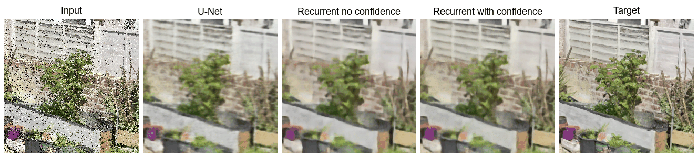
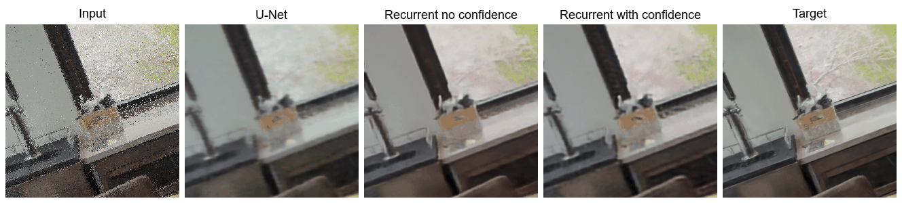

# Gaussian Splat Rendering Denoiser

WebGPU pipeline for running a denoising recurrent autoencoder model on noisy stochastic Gaussian splat renders. Inference is run on the ONNX backend.

<p align="center">
  
</p>

<p align="center">
  
</p>


A demo scene of an office environment is provided under:

```text
public/splats/office.splat
```

## Models

The project includes three ONNX-exported models in:

```text
public/models
```

### Available Models

| Model | Description |
|---|---|
| `RecurrentDenoisingAutoencoder_C24_ClosedRooms.onnx` | Trained on 3 scenes for 200 epochs. |
| `RecurrentDenoisingAutoencoderConfidence_C24_ClosedRooms.onnx` | Trained on 3 scenes for 200 epochs with confidence map auxiliary inputs. |
| `RecurrentDenoisingAutoencoderConfidence_C24_FP16_ClosedRooms.onnx` | Same confidence-map model, exported for an FP16 half-precision inference pipeline. |

For additional details, see the project report:

```text
report.pdf
```

All trained model checkpoints are available at `https://drive.google.com/drive/folders/1KbpdD_-V-NknwFDElOhJkZ09CIc2mPX3?usp=drive_link`

## Setup

```bash
cd GaussianSplatRenderingDeinoiser
npm install
npm run dev
```

## Model Training Setup

All model training scripts are located under:

```text
autoencoder_training
```

The provided `requirements.txt` reflects a local setup configuration. Adjust the package versions as needed for your own GPU setup.

## Credits

The architecture of the recurrent model was heavily inspired by the following paper:

```bibtex
@article{paper,
  author = {Chaitanya, Chakravarty R. Alla and Kaplanyan, Anton S. and Schied, Christoph and Salvi, Marco and Lefohn, Aaron and Nowrouzezahrai, Derek and Aila, Timo},
  title = {Interactive Reconstruction of Monte Carlo Image Sequences Using a Recurrent Denoising Autoencoder},
  journal = {ACM Transactions on Graphics},
  volume = {36},
  number = {4},
  articleno = {98},
  pages = {1--12},
  year = {2017},
  publisher = {ACM},
  doi = {10.1145/3072959.3073601}
}
```

The office scene was downloaded from SuperSplat. All credits go to the original creator.
- Source: <https://superspl.at/scene/d152f2df>
- Creator: `"Gunja514"` by Lee Kyumin
- Creator profile: <https://superspl.at/user?id=qjayo>
- License: [CC BY 4.0](https://creativecommons.org/licenses/by/4.0/)